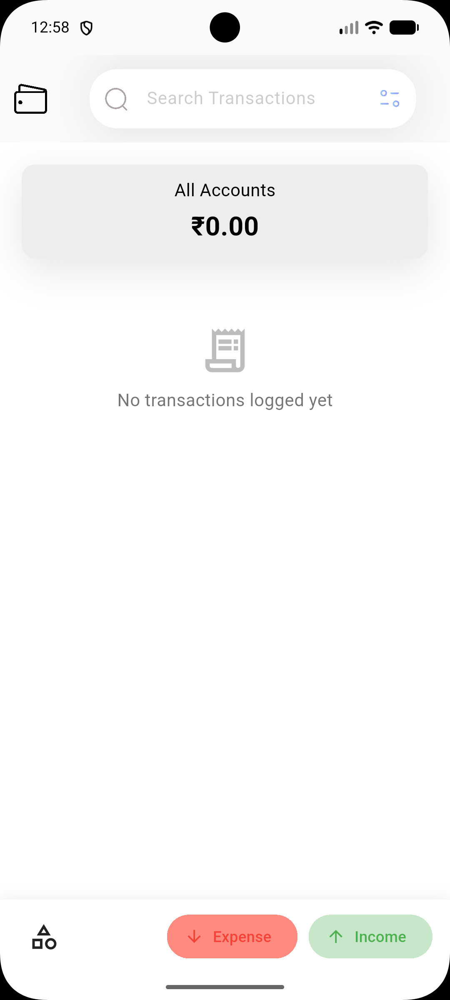
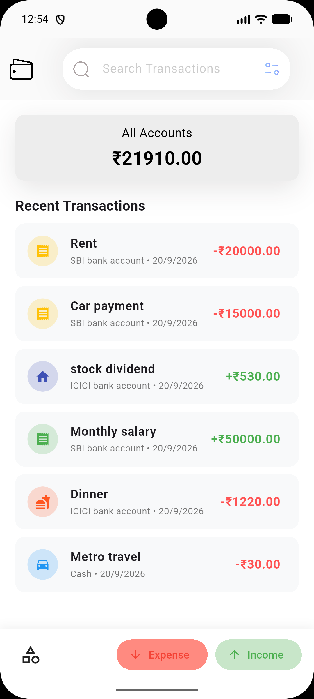
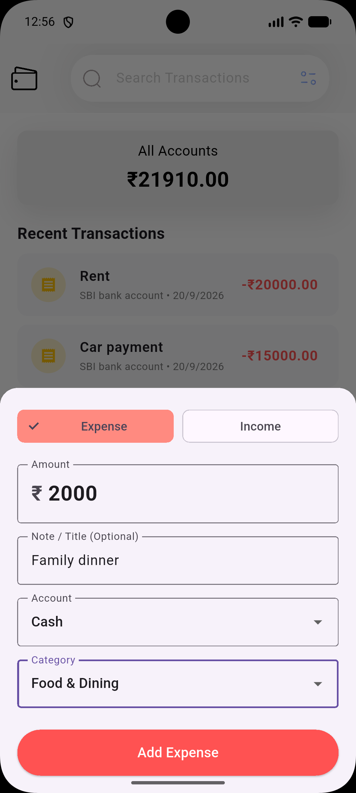
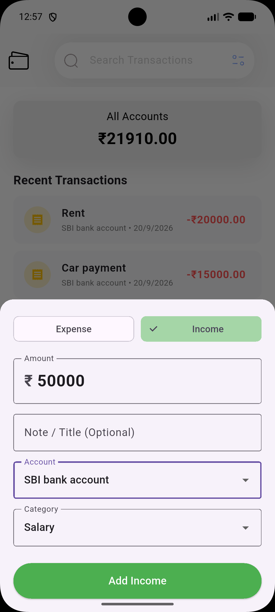
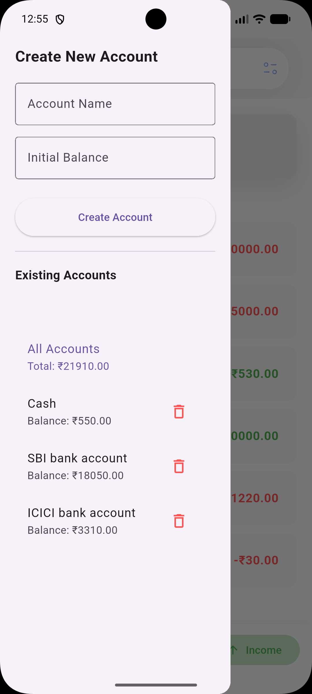
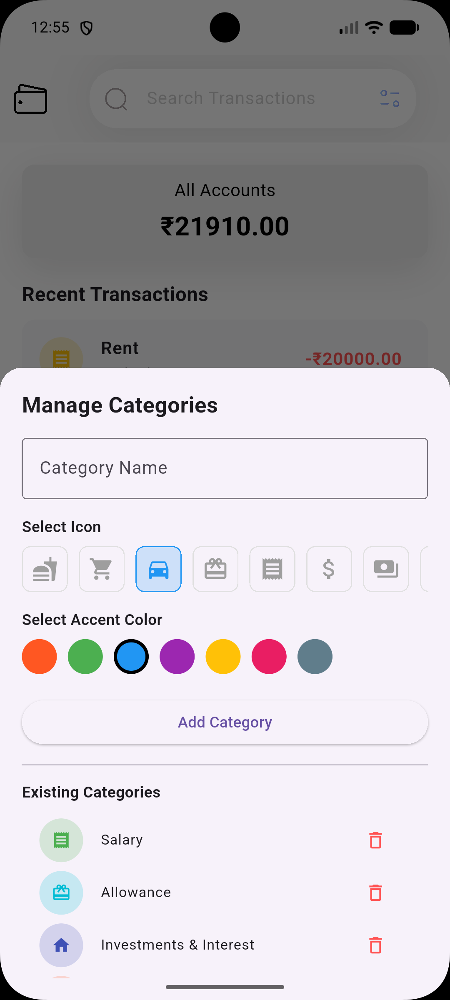
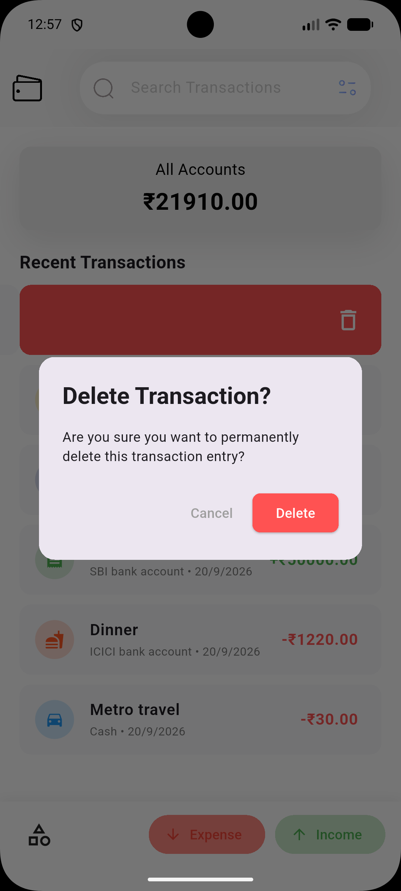

# 📱 Budgyfy – Personal Budgeting & Expense Tracker

**Budgyfy** is a clean, modular Flutter mobile application designed to simplify personal expense and income tracking. Built around multi-account management, custom category tagging, and local persistence, Budgyfy helps users monitor their net worth and spending habits effortlessly.

---

## ✨ Features Built So Far

* 💼 **Multi-Account Tracking:** Manage distinct payment methods (e.g., *Cash*, *Online*, *Bank*) alongside an aggregated **All Accounts** net-worth wrapper.
* 🏷️ **Global Category Management:** Create and customize global income and expense categories with dynamic color palettes and financial icon sets.
* 💸 **Real-Time Transaction Logging:** Log expenses and income with instant account balance recalculations and updates.
* 🔄 **Interactive Transaction History:** Full CRUD support featuring swipe-to-delete safeguards and tap-to-edit modal sheets.
* 💾 **Local Persistence:** Fast, lightweight disk storage via JSON serialization (`SharedPreferences`).
* ⚡ **Optimized APK Footprint:** Split-ABI production release builds (~18 MB).

---

## 📸 App Screenshots

| Initial State | Main Dashboard | Add Expense Modal | Add Income Modal |
| :---: | :---: | :---: | :---: |
|  |  |  |  |

| Account Drawer | Category Modal | Delete Alert |
| :---: | :---: | :---: |
|  |  |  |

---

## 🏗️ Architecture & Folder Structure

Budgyfy follows a **Modular Architecture** adhering to the **Single Responsibility Principle (SRP)**:
```text
lib/
├── models/         # Data blueprints & JSON serialization (Account, Category, Transaction)
├── services/       # Disk I/O & local persistence (LocalStorageService)
├── widgets/        # Isolated, reusable UI components (AppBar, Drawer, Modals, Lists)
└── screens/        # State controllers & layout orchestrators (HomePage)
```
---

🛠️ Tech Stack & Dependencies
Framework: Flutter (Dart)

IDE: VS Code / Android Studio

State Management: Reactive StatefulWidget & callback orchestration

Storage: SharedPreferences (JSON serialization)

---

📥 Installation & Running Locally
Prerequisites
Flutter SDK (v3.0.0 or higher)

Android Studio / VS Code with Flutter extension

An Android Emulator or physical Android device

Steps
1. Clone the repository:

Bash
git clone [https://github.com/Faahad-Shaik/Budgyfy.git](https://github.com/Faahad-Shaik/Budgyfy.git)
cd Budgyfy

2. Install dependencies:

Bash
flutter pub get

3. Run the application:

Bash
flutter run

---

📦 Download Release APK
Want to test Budgyfy directly on your physical Android device?

Go to the Releases Page.

Download the app-arm64-v8a-release.apk file.

Install it on your phone!

---

🛣️ Roadmap & Upcoming Features
[ ] SQLite Database Migration (sqflite): Fast, relational offline queries.

[ ] Dedicated Transactions Screen: Separate list view with full history.

[ ] Live Search & Multi-Filtering: Filter transactions by note text, category, account, type, or date.

[ ] Monthly Category Budgets: Spending limit targets with Safe / Caution / Over-budget alerts.

[ ] Recurring Transactions & Reminders: Scheduled commute fares / salary reminders with interactive Yes/No local push notifications.

[ ] Expense Analytics Pie Chart: Visual spending distribution charts.

---
📄 License
This project is open-source and available under the MIT License.
